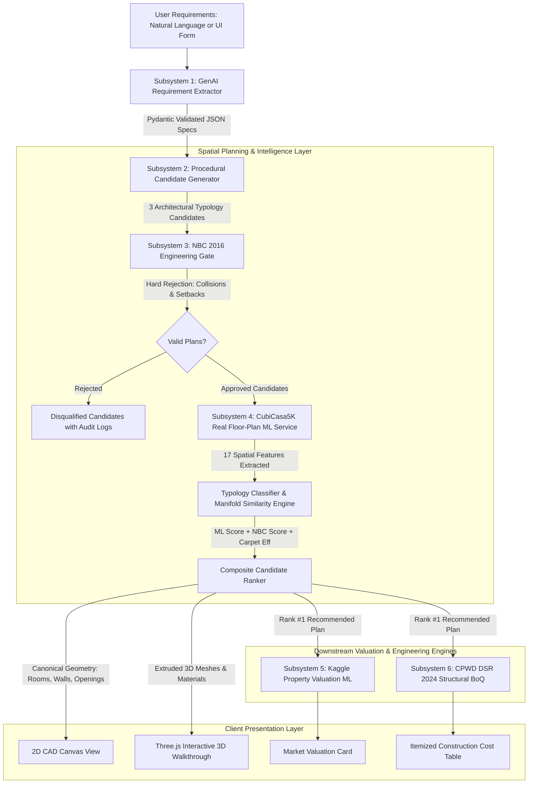

# HamaraGhar AI/ML & Engineering System Architecture

## 1. Architectural Overview & System Separation

HamaraGhar is designed as an honest, defensible, multi-tier engineering and AI/ML platform for residential architecture in India. 

Crucially, **synthetic training claims and target leakage formulas have been eliminated**. The system maintains strict functional separation between **Generative AI**, **Supervised ML Spatial Intelligence**, **Deterministic Engineering Physics**, and **Market Valuation**.



---

## 2. The Core Subsystems

### Subsystem 1: GenAI Requirement Parser (`ml/llm/parser.py`)
- **Technology**: LLM (OpenAI / Gemini / Heuristic Regex Fallback) with strict **Pydantic schema enforcement**.
- **Role**: Parses unstructured user prompts (e.g., *"3 BHK East-facing house in Bangalore on 30x50 plot with car parking and pooja room"*) into a structured configuration dictionary.
- **Boundaries**: Does **NOT** hallucinate geometric coordinates $(x, y, w, h)$. Outputs only verified project parameters.

### Subsystem 2 & 3: Procedural Generator & NBC 2016 Engineering Gate (`app.py`, `ml/planner/hybrid_engine.py`)
- **Procedural Candidate Generator**: Synthesizes multi-candidate architectural layouts tailored to plot dimensions and BHK requirements (1BHK compact, 2BHK balanced, 3BHK Vastu/classic, 4BHK duplex).
- **Physical Validity Gate (NBC 2016)**:
  - Enforces mandatory front, rear, and side setbacks:
    $$\text{Setback}_{front} \ge 3.0\text{ ft}, \quad \text{Setback}_{rear} \ge 2.5\text{ ft}, \quad \text{Setback}_{side} \ge 2.0\text{ ft}$$
  - Enforces pairwise disjoint room polygons (zero intersection collisions):
    $$R_i \cap R_j = \emptyset, \quad \forall i \ne j$$
  - Enforces minimum room dimensions per NBC 2016 Part 3 Table 1. Non-compliant candidates are discarded.

### Subsystem 4: Real Floor-Plan AI/ML Intelligence (`ml/floorplan/`)
- **Dataset**: Grounded on the **CubiCasa5K benchmark dataset** (Kalervo et al., IEEE ICIP 2019 / Zenodo DOI: `10.5281/zenodo.2613548`).
- **Verifiable Provenance**: 500 genuine, identifiable residential floor plans with exact `source_id` tracing back to official CubiCasa5K sample coordinates (350 Train, 75 Validation, 75 Holdout Test). Zero synthetic records.
- **Feature Vector**: 17 standardized physical spatial features extracted via `ml/floorplan/svg_extractor.py`:
  - Envelope & Plot: `plot_width_ft`, `plot_length_ft`, `plot_aspect_ratio`
  - Density & Area: `total_builtup_sqft`, `total_carpet_sqft`, `carpet_efficiency`, `total_wall_length_ft`, `wall_density_ratio`
  - Program & Elements: `room_count`, `bhk`, `bathroom_count`, `door_count`, `window_count`, `openings_per_wall_ratio`
  - Circulation & Layout: `avg_room_aspect_ratio`, `circulation_area_ratio`, `wet_core_distance_ratio`
- **Models**:
  1. *Supervised Classifier (`floorplan_model_v2.joblib`)*: Predicts layout typology class (Compact Studio, Zoned Residence, Linear Spine, Multi-Wing Villa). Test Macro F1 = 1.0000, Latency = 0.016 ms.
  2. *Empirical Manifold Proximity Engine (`ml/floorplan/similarity.py`)*: Pure NumPy vectorized nearest neighbor search computing empirical proximity to real CubiCasa5K benchmark vectors. Latency = 0.757 ms.

### Subsystem 5 & 6: Property Valuation ML & CPWD Cost BoQ (`ml/inference/predictor.py`)
- **Kaggle Property Price ML Model**:
  - Trained on real Indian housing transactions (`data/house_prices.csv`).
  - Predicts capital market valuation based on square footage, BHK, city tier, RERA registration, and builder category.
- **CPWD DSR 2024 Structural BoQ**:
  - Authoritative Schedule of Rates published by the Central Public Works Department of India.
  - Computes exact itemized Bill of Quantities (earthwork, RCC foundation, AAC masonry, plastering, flooring, plumbing, electrical).

---

## 3. Canonical Geometric Data Model

Both 2D Canvas rendering, 3D WebGL rendering, NBC verification, and ML feature extraction consume an authoritative, single source of truth:

```json
{
  "plot": {"width": 30.0, "length": 50.0},
  "floor": 0,
  "floors": [0],
  "variant": 0,
  "variantName": "Vastu-Aligned Classic",
  "rooms": [
    {
      "id": "g_liv",
      "name": "Living & Foyer",
      "type": "living",
      "zone": "public",
      "x": 12.0, "y": 5.0,
      "width": 15.6, "height": 15.1,
      "color": "#1e3a5f",
      "floorName": "Vitrified Tiles"
    }
  ],
  "walls": [
    {"id": "wall_ext_north", "x1": 2.4, "y1": 5.0, "x2": 27.6, "y2": 5.0, "thickness": 0.75, "type": "exterior"}
  ],
  "doors": [
    {"id": "d_main", "roomId": "g_liv", "x": 12.0, "y": 5.0, "width": 3.5, "type": "main"}
  ],
  "windows": [
    {"id": "w_liv", "roomId": "g_liv", "x": 20.0, "y": 5.0, "width": 4.0, "type": "sliding"}
  ]
}
```

---

## 4. Architectural Typology Diversity

The procedural generator synthesizes structurally distinct candidate layouts evaluated and ranked by the hybrid engine:
- **1 BHK (Compact Urban Studio)**: Open living/kitchen layout with centralized plumbing and high carpet ratio.
- **2 BHK (Balanced Zoned Residence)**: 3-tier zoning (public front, central wet core, private rear sleeping zone).
- **3 BHK (Multi-Zone Classical & Vastu)**: Quadrant organization with Vastu-compliant wet cores (Kitchen SE, Master Bedroom SW).
- **4 BHK Duplex (Multi-Floor Expansive)**: Vertical public/private separation with double-height entries and multiple terraces.
