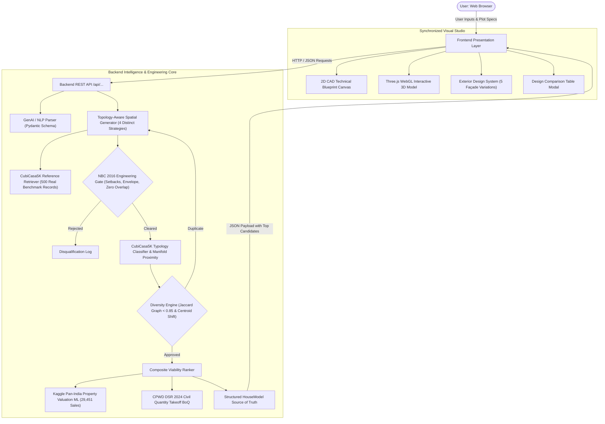

# HamaraGhar (हमारा घर) — AI/ML Hybrid Architectural Design & Civil Engineering Platform

[]()
[]()
[]()
[-purple.svg)]()

HamaraGhar is a production-grade, AI/ML-driven architectural space-planning and civil engineering platform. It transforms natural language and dimensional plot constraints into verified technical architectural layouts, interactive 2D blueprints, synchronized WebGL 3D walkthroughs, CPWD construction cost quantity takeoffs, and predictive real estate property valuations.

---

## 1. Monorepo Architecture

The repository is organized into a clean, decoupled monorepo with strict separation between presentation and application logic:

```
HamaraGhar/
│
├── frontend/                  # Presentation Layer (UI, 2D Blueprint, 3D WebGL)
│   ├── src/
│   │   ├── components/        # Reusable UI widgets (CandidateSwitcher, ExteriorSelector, CompareModal)
│   │   ├── pages/             # Page controllers (studio-page.js, dashboard.js, requirements.js, etc.)
│   │   ├── layouts/           # Page layout shells & HTML templates
│   │   ├── services/          # API client (api.js) communicating with Backend
│   │   ├── hooks/             # Reactive state and lifecycle hooks
│   │   ├── state/             # Canonical HouseModel & StudioSyncManager
│   │   ├── utils/             # Formatting and geometrical utilities
│   │   ├── 2d/                # 2D technical CAD blueprint engine (floorplan-2d-renderer.js)
│   │   ├── 3d/                # Three.js 3D procedural generator & exterior façade engine
│   │   └── styles/            # Design system CSS stylesheets (main.css, pages.css, builder.css)
│   ├── public/                # Static assets, HTML views, vendor scripts (three.min.js, OrbitControls.js)
│   ├── package.json           # Frontend dependencies and build/dev scripts
│   └── README.md              # Frontend architecture and development guide
│
├── backend/                   # Application & Intelligence Layer (API, AI/ML, Engineering, DB)
│   ├── api/                   # API blueprints & routing entry points
│   ├── routes/                # Modular route controllers (auth, projects, data, pages)
│   ├── controllers/           # HTTP request handlers
│   ├── services/              # Business logic coordinators
│   ├── ai/
│   │   └── genai/             # Gemini LLM client, Pydantic prompt schemas & constraint validation
│   ├── ml/
│   │   ├── floorplan/         # 500 genuine CubiCasa5K dataset records, features, inference, manifold similarity
│   │   ├── valuation/         # Kaggle pan-India property valuation ML model & feature pipeline
│   │   ├── inference/         # Unified inference services
│   │   └── artifacts/         # Serialized joblib models, scalers, and provenance manifests
│   ├── architecture/
│   │   ├── generator/         # Topology-aware candidate generator (Plan A, B, C, D)
│   │   ├── constraints/       # Spatial features & physical bounding constraints
│   │   ├── nbc/               # NBC 2016 Part 3 engineering clearance gate
│   │   ├── topology/          # Structural adjacency graph & centroid duplicate detector
│   │   └── cubicasa/          # CubiCasa5K empirical reference retriever
│   ├── cost/
│   │   └── cpwd/              # CPWD DSR quantity takeoff BoQ engine & materials rates
│   ├── database/              # SQLAlchemy models, SQLite configuration & migrations
│   ├── models/                # User, Project, HouseModel database entities
│   ├── validators/            # Security validation, rate limiting, and prompt sanitization
│   ├── config/                # Environment loading, CORS, and settings mapping
│   ├── docs/                  # Forensic reports, architectural audits, and provenance logs
│   ├── tests/                 # 12 test suites (all 59 automated tests passing)
│   ├── app.py                 # Primary Flask REST API server
│   ├── requirements.txt       # Python package dependencies
│   └── README.md              # Backend architecture and API contracts guide
│
├── .gitignore                 # Repository-wide ignore rules
└── README.md                  # Master documentation (this file)
```

---

## 2. System Flow Diagram



---

## 3. Strict Separation of Responsibilities

| Responsibility Area | Handled By | Guarantees & Constraints |
| :--- | :--- | :--- |
| **User Interface & Controls** | `frontend/` | Pure presentation; renders forms, plot inputs, candidate selectors, camera toolbars, and comparison modals. |
| **Technical 2D Blueprints** | `frontend/src/2d/` | Renders rooms, dimension strings, door swings, and window symbols directly from the canonical `HouseModel`. |
| **Interactive 3D Walkthrough** | `frontend/src/3d/` | Extrudes walls, slabs, windows, and exterior materials procedurally via Three.js. |
| **Exterior Façade System** | `frontend/src/3d/` | Applies 5 distinct exterior design styles (Modern, Contemporary, Traditional, Luxury, Simple) with internal room geometry 100% locked. |
| **REST API Server** | `backend/app.py` | Flask API server with CORS enabled (`ALLOWED_ORIGINS`). |
| **Spatial Generation & NBC** | `backend/architecture/` | Procedural multi-candidate synthesis under National Building Code (NBC 2016 Part 3) engineering constraints. |
| **Real Floor-Plan ML** | `backend/ml/floorplan/` | 500 genuine CubiCasa5K records (`processed_floorplans.json`), 17 physical features, Supervised Typology Classifier, and Manifold Similarity search. |
| **Market Property Valuation** | `backend/ml/valuation/` | Supervised `HistGradientBoostingRegressor` trained on 29,451 Kaggle pan-India real estate sales. |
| **Civil Quantity Takeoff** | `backend/cost/cpwd/` | Itemized Bill of Quantities (BoQ) based on CPWD Delhi Schedule of Rates (DSR 2024). |
| **Database & Auth** | `backend/models/` | SQLite / SQLAlchemy persistence with password hashing and session tokens. |

---

## 4. Key API Endpoints

| Method | Endpoint | Description |
| :--- | :--- | :--- |
| `POST` | `/api/ml/hybrid-plan` | Generates 3+ diverse, NBC-verified layout candidates adapted from CubiCasa5K references with fixed room dimensions preserved. |
| `POST` | `/api/ml/parse-requirements` | Parses conversational natural language requirements into structured parameters via GenAI or rule-based fallback. |
| `POST` | `/api/ml/predict-property-price` | Computes property capital market valuation, per-sq.ft rate, and 90% confidence intervals. |
| `POST` | `/api/ml/calculate-construction-cost` | Calculates itemized CPWD BoQ construction estimate (structure, masonry, flooring, MEP). |
| `GET` | `/api/projects` | Lists all saved projects for authenticated user. |
| `POST` | `/api/projects` | Saves a design snapshot with complete canonical `HouseModel`. |
| `GET` | `/api/data/materials` | CPWD specification material schedule. |
| `GET` | `/api/data/risk/<city>` | Location hazard profile (seismic zone, flood susceptibility). |

---

## 5. Quickstart & Local Development

### 1. Backend Setup
```bash
# Navigate to backend directory
cd backend

# Install dependencies
pip install -r requirements.txt

# Run the backend test suite (59 tests)
python -m unittest discover -s tests -p "test_*.py"

# Start the Flask API server (runs on http://127.0.0.1:5000)
python app.py
```

### 2. Frontend Setup
```bash
# In a separate terminal, navigate to frontend directory
cd frontend

# Install dependencies
npm install

# Start local dev server (Vite or static server on http://localhost:3000)
npm run dev
```

---

## 6. Scientific & Engineering Provenance

- **CubiCasa5K Reference Dataset**: 500 verified real residential floor plans (Zenodo DOI: `10.5281/zenodo.2613548`, CC BY-NC 4.0).
- **Engineering Safety**: Strict National Building Code of India (NBC 2016 Part 3 Table 1) compliance gate.
- **Valuation ML Benchmark**: 29,451 Pan-India housing transaction records.
- **Costing Standard**: Central Public Works Department (CPWD DSR 2024) Schedule of Rates.
