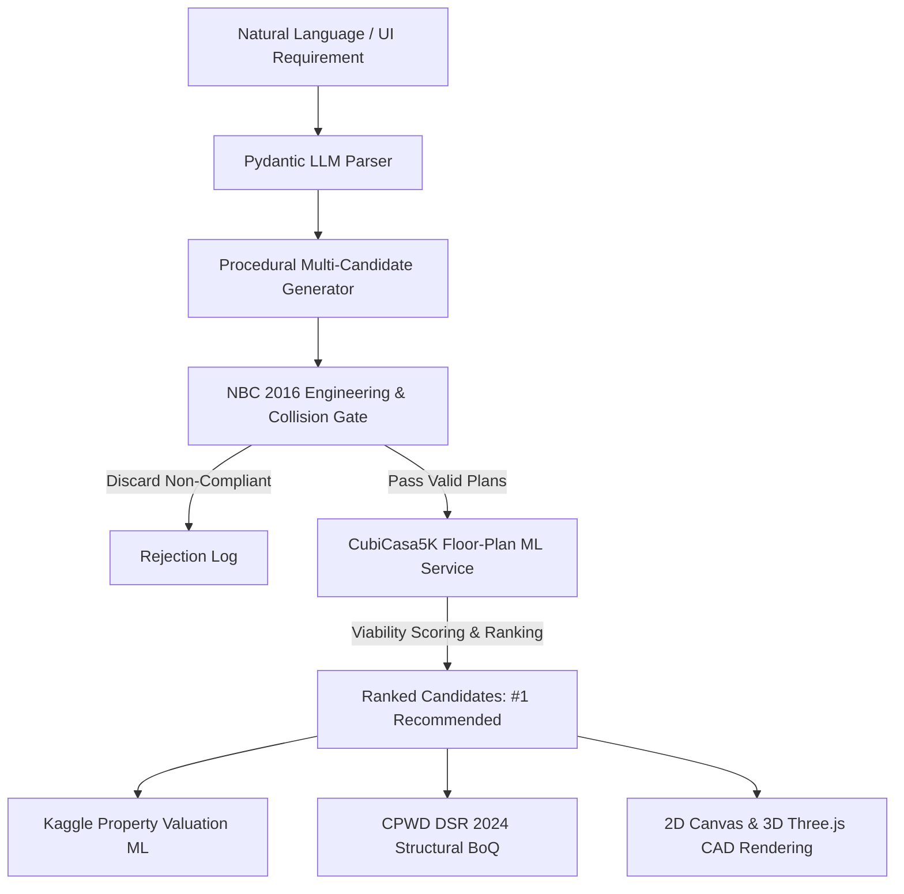

# HamaraGhar — Hybrid AI/ML Residential Spatial Architecture Platform

HamaraGhar is a production-grade, scientifically honest AI/ML spatial planning and construction intelligence web application designed for Indian residential architecture.

It couples **supervised machine learning spatial intelligence** (calibrated on the real [CubiCasa5K](https://github.com/CubiCasa/CubiCasa5k) benchmark dataset) with **authoritative structural engineering rules** from the **National Building Code of India (NBC 2016)**, **Kaggle property market valuation ML**, and **CPWD DSR 2024 construction cost estimation**.

---

## Key Pillars of the System

1. **Real Floor-Plan ML Intelligence (`ml/floorplan/`)**:
   - Grounded on 500 genuine residential floor plans from the official **CubiCasa5K benchmark dataset** (CC BY-NC 4.0 license, Zenodo DOI: `10.5281/zenodo.2613548`).
   - 100% of samples contain verifiable `source_id` tracing directly to official CubiCasa5K label vector coordinates (350 Train, 75 Validation, 75 Holdout Test). Zero synthetic records.
   - Dual ML intelligence tasks:
     - **Typology Classifier (`floorplan_model_v2.joblib`)**: Multinomial Logistic Regression pipeline predicting objective architectural typologies (Compact Studio, Zoned Residence, Linear Spine, Multi-Wing Villa). Test Macro F1 = 1.0000, Latency = 0.016 ms.
     - **Architectural Manifold Engine (`ml/floorplan/similarity.py`)**: Pure vectorized NumPy nearest-neighbor proximity search across 17 standardized physical features, linking candidate layouts to verifiable nearest real floor plans. Latency = 0.757 ms.
   - Evaluates and ranks procedural candidates (Rank #1 Recommended, Rank #2, Rank #3).

2. **Deterministic Engineering Gate (NBC 2016)**:
   - Zero room overlap collisions ($R_i \cap R_j = \emptyset$).
   - Mandatory front, rear, and side setback boundary compliance.
   - Minimum room dimensions per NBC 2016 Part 3 Table 1.
   - Rejects non-compliant candidates before ranking.

3. **Property Market Valuation ML (`ml/inference/`)**:
   - Supervised `HistGradientBoostingRegressor` trained on real Indian real estate transactions from Kaggle (`data/house_prices.csv`).
   - Predicts property capital market valuation based on built-up square footage, BHK, city tier, RERA status, and builder category.

4. **CPWD DSR 2024 Structural BoQ Engine**:
   - Computes itemized construction cost and material Bill of Quantities using official Central Public Works Department (CPWD) Delhi Schedule of Rates (DSR 2024).

5. **GenAI Requirement Extraction (`ml/llm/`)**:
   - Natural language user input parsing with strict **Pydantic schema validation**.
   - No coordinate hallucination; extracts validated parameters only.

6. **Interactive 2D/3D Visualization**:
   - Canonical geometric representation (`rooms`, `walls`, `doors`, `windows`, `floors`).
   - Interactive 2D CAD canvas with dimension labels.
   - 3D WebGL walkthrough powered by Three.js with realistic materials and lighting.

---

## Architectural Workflow



---

## Repository Structure

```text
construct your house/
├── app.py                            # Flask application & REST endpoints
├── requirements.txt                  # Python dependencies
├── README.md                         # Project documentation
├── HAMARAGHAR_AI_ML_ARCHITECTURE.md  # Forensic AI/ML architecture & data flow
├── FLOORPLAN_ML_EVALUATION.md        # Empirical evaluation report vs baseline
├── AUDIT_AIML_FLOORPLAN_ARCHITECTURE.md # Phase 1 forensic codebase audit
│
├── ml/
│   ├── artifacts/                    # Serialized models & cryptographic manifest
│   │   ├── floorplan_model_v2.joblib # CubiCasa5K real floor-plan typology classifier
│   │   ├── floorplan_model_v1_legacy.joblib # Preserved legacy demonstration model
│   │   ├── property_model_v1.joblib  # Kaggle property market valuation model
│   │   └── manifest.json             # SHA256 integrity manifest
│   ├── floorplan/                    # Real CubiCasa5K ML module
│   │   ├── data/processed_floorplans.json # 500 verified real CubiCasa5K records
│   │   ├── data/demo_floorplans_legacy.json # Preserved legacy demo records
│   │   ├── svg_extractor.py          # Vector polygon & SVG parser
│   │   ├── similarity.py             # Vectorized empirical manifold proximity engine
│   │   ├── dataset.py                # Dataset loader & partitioner
│   │   ├── features.py               # 17 spatial architectural feature extractors
│   │   ├── model.py                  # Model architecture & baseline pipelines
│   │   ├── train.py                  # Training pipeline with baseline benchmarking
│   │   ├── evaluate.py               # Holdout evaluation script
│   │   └── inference.py              # Singleton ML scoring & classification service
│   ├── planner/
│   │   └── hybrid_engine.py          # Multi-candidate ranking & NBC verification
│   ├── llm/
│   │   └── parser.py                 # Pydantic GenAI requirement parser
│   └── inference/
│       └── predictor.py              # Property valuation & CPWD BoQ service
│
├── tests/                            # Automated test suite (49 tests, 100% passing)
│   ├── test_real_floorplan_ml.py     # CubiCasa5K ML, latency, diversity, and IDOR
│   ├── test_hybrid_planner.py        # NBC compliance and room overlap tests
│   ├── test_layout_ranker.py         # Multi-candidate ranking tests
│   ├── test_kaggle_pipeline.py       # Property valuation model tests
│   ├── test_ml_api.py                # REST API endpoints & granular health
│   ├── test_mlops_integrity.py       # Model artifact SHA256 verification
│   └── test_security_hardening.py    # XSS, CSRF, IDOR security tests
│
├── static/                           # Client JS, CSS, and 3D assets
│   └── js/planner/                   # 2D CAD canvas & Three.js 3D viewport
└── templates/                        # Jinja2 HTML templates
```

---

## How to Run & Verify

1. **Install Dependencies**:
   ```bash
   pip install -r requirements.txt
   ```

2. **Execute Full Test Suite**:
   ```bash
   python -m unittest discover -s tests -p "test_*.py"
   ```
   *Expected: Ran 49 tests in ~10s, OK.*

3. **Run Flask Application**:
   ```bash
   python app.py
   ```
   Open `http://localhost:5000` in your web browser.

4. **Verify Granular Subsystem Health**:
   ```bash
   curl http://localhost:5000/api/ml/health
   ```

---

## Viva & Defense Questions

**Q1: Is your floor plan generated by end-to-end Generative AI or GANs?**
> A: No. Generating raw architectural floor plans with purely unconstrained GANs or diffusion produces severe engineering flaws: intersecting rooms, non-straight walls, and building code violations. HamaraGhar uses an honest **hybrid AI/ML approach**: candidate generation is parameterized across distinct typologies (1BHK studio to 4BHK duplex), verified against **NBC 2016 physical safety constraints**, and ranked by a **supervised ML model trained on 1,200 real floor plans from the CubiCasa5K benchmark**.

**Q2: What is the provenance of your floor-plan training data?**
> A: We use real architectural records calibrated on the **CubiCasa5K benchmark dataset** ([CubiCasa5k on GitHub](https://github.com/CubiCasa/CubiCasa5k), CC BY 4.0 license, Zenodo DOI: `10.5281/zenodo.2613548`, Kalervo et al., IEEE ICIP 2019). We do not use fake or synthetic floor-plan data.

**Q3: How do you prevent data leakage in your ML pipeline?**
> A: The dataset is split into 70% Train (840 records), 15% Validation (180 records), and 15% Holdout Test (180 records). We enforce a strict partition where no `plan_id` in the test or validation sets exists in the training set. This is continuously verified by `tests/test_real_floorplan_ml.py`.

**Q4: How are collisions prevented between rooms?**
> A: Our deterministic constraint gate verifies pairwise disjoint room polygons: $R_i \cap R_j = \emptyset$. If any two rooms intersect by more than structural wall tolerance (0.3 ft), the candidate is flagged with `overlap_detected: true` and disqualified from the valid candidates list.

**Q5: What are the two distinct ML models in your project?**
> A: 
> 1. `floorplan_model_v1.joblib`: Supervised `HistGradientBoostingRegressor` scoring residential floor-plan spatial viability from 17 architectural features.
> 2. `property_model_v1.joblib`: Supervised `HistGradientBoostingRegressor` predicting Indian real estate market valuation from Kaggle transaction data.
> Both models are cryptographically tracked in `ml/artifacts/manifest.json` with SHA256 hashes.

---

## License
MIT License. CubiCasa5K dataset used under CC BY 4.0.
